# README

# A link (URL) to your published App
- https://lit-spire-85165.herokuapp.com/

# A link to your GitHub repository
- https://github.com/lilianamolloy/tradeup
- https://github.com/Aitzu/tradeup
- https://github.com/zainab-y/tradeup

# Description of the project TradeUp
## Problem definition / purpose

TradeUp is a Ruby on Rails application designed, built,deployed and presented by Lili, Aitzu and Zainab. This app will cater to two markets, property managers and tradespeople.

##### Problem

In the real estate industry, property managers have a role to assist tenants in finding a tradesperson to fix structural and/or safety issues within their home.

Usually these issues are small jobs such as a broken door handle, putting a lightbulb in, that require a short time to complete.

The problems that property managers face is that they only have a handful selection of tradespeople to contact within their real estate agency and finding a tradesperson willing to accept the job.

Tradespeople face problems too when accepting or declining job proposals from property managers. These can range from travelling to different locations, short amount of time spent on the job, small pay and peak seasons where tradespeople are unavailable the most.

##### Solution

TradeUp provides a solution for these problems faced property managers and tradespeople who will use it to fill in that gap.

So far property managers go through the method of contacting tradespeople by phone, and because of this they have a limited reach. The app will address their problem by reaching more tradespeople through the internet within their location, by doing this they have a higher chance of someone taking on their job.

It is a solution for tradespeople if they are out of work, between jobs, or willing to accept small jobs.

It is a solution for tenants who will find that their home maintenance issue is fixed sooner.

Our brainstorming process encouraged us all to look at the industries we came from and to assess any potential problem that could be solved with a two sided marketplace. One of our team members coming from a realestate background proposed the idea,which we all were interested in addressing.

## Functionality / features

The main functionality on the app is the ability for Property managers to create jobs and then the ability for Trades People to accept that job. 

We also included a 'My Jobs' dashboard where a user can keep track of all their jobs and the different statuses of their job(s).

Once the job is marked as complete by the tradesperson, we allow the property manager to pay through stripe on the jobs show page. The job is then archived but can still be viewed through the user dashboard.

Ideally if we didn't have such a tight time constraint we would have collected the funds from the property Manager at the beginning confirming funds were available before posting the job. The funds would only be released once the job was completed and confirmed by the property manager. This would be better for the user experience and give tradespeople a sense of trust that they will be paid.

Other features include auto complete of the address field this was accomplished through the Google geolocation API.

A search feature was added to the job index page, we created a serach action which passed params to query the database. There is the ability to serach by category, postcode or both.

We setup mailer to alert the job creator at certain points where their job status changed including, someone accepting the job and completion letting them know it is ready to be paid.

Verification email is sent out when a user signs up through devise. So the user is only generated when their email is confirmed.

Another feature we worked on was the configuration of the routes for when a user is not signed in. The user has the ability to click 'Become a Tradie' / submit the form on the home page which will redirect them accordingly once signed up or even if they click sign in from the sign up page. 

Unfortunetly this feature which we included for better user experience did not integrate well with the verification email we installed as the route path changed due to this. We were not able to resolve this issue due to time constrains. In future we would look into passing params through the email for correct redirection.

# Screenshots

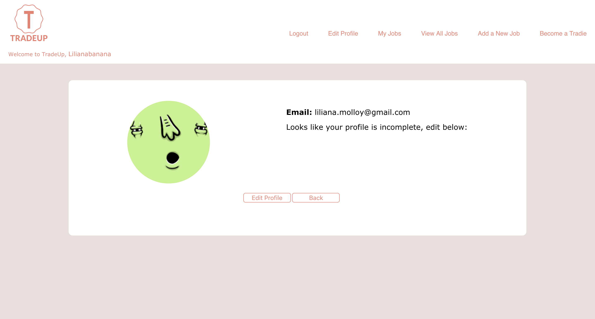
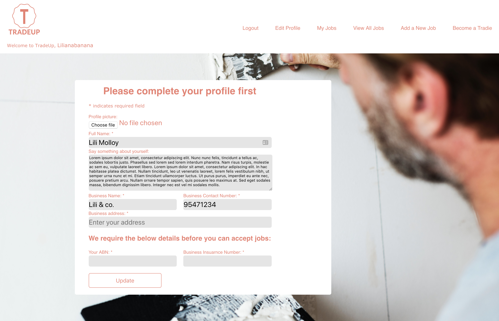
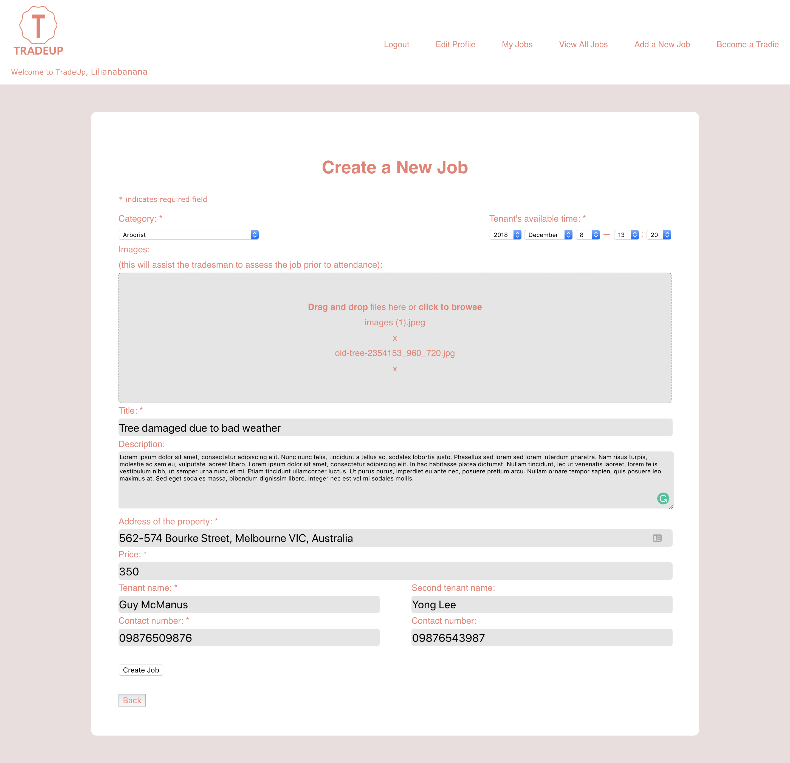

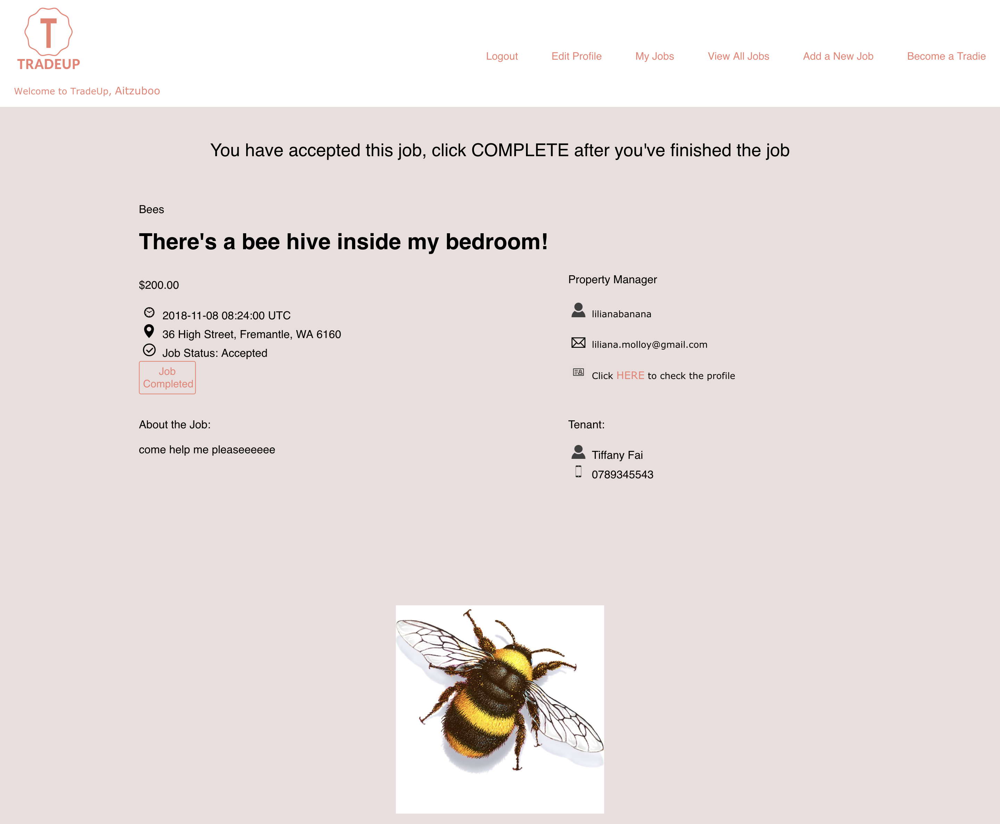
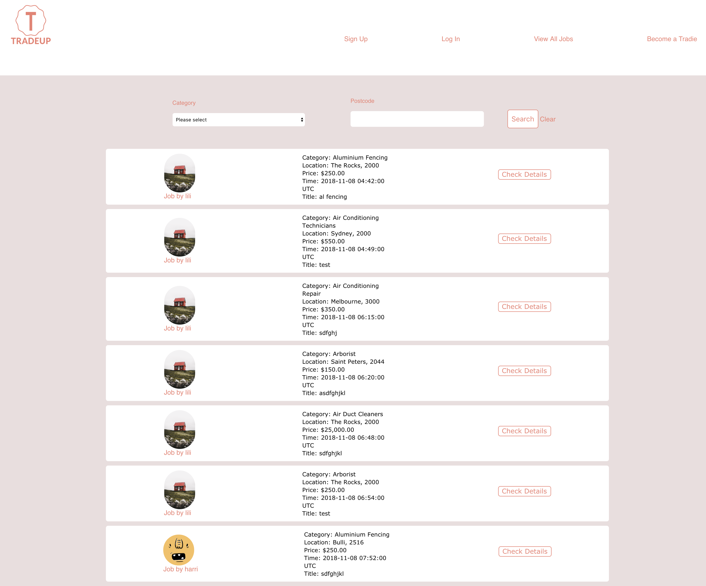
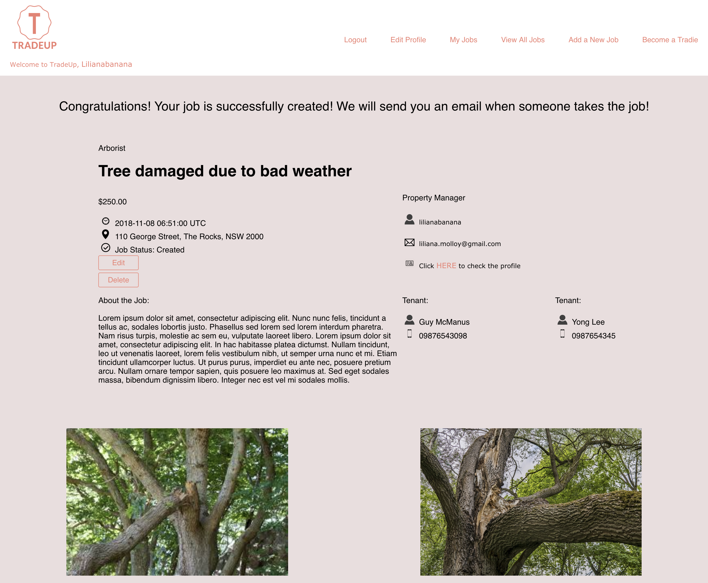

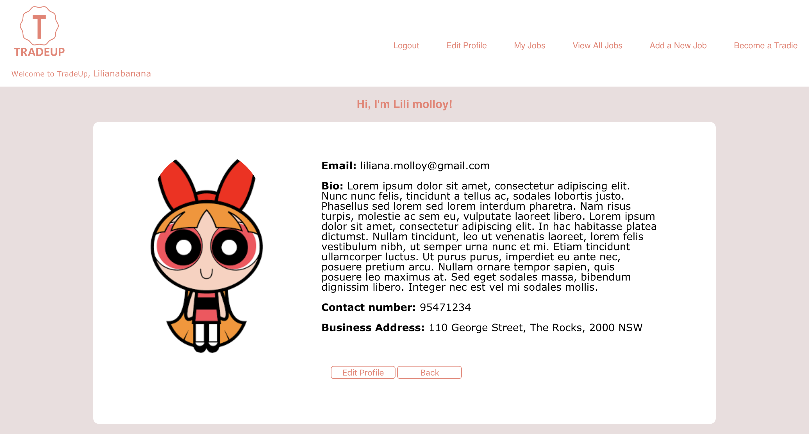
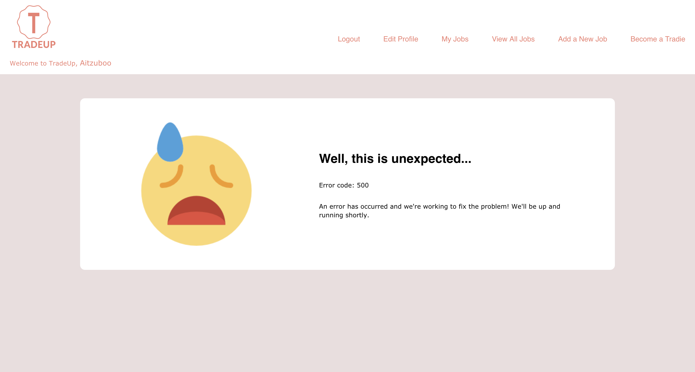
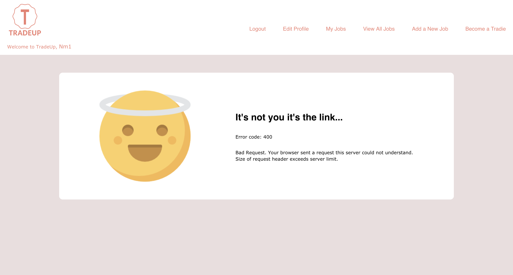

# Tech stack (e.g. html, css, deployment platform, etc)

                ⋅⋅* HTML
                ⋅⋅* CSS
                ⋅⋅* Ruby
                ⋅⋅* Ruby on Rails
                ⋅⋅* Java Script
                ⋅⋅* Heroku - deployment
                ⋅⋅* AWS - s3 storage service
                ⋅⋅* Google geo location API
                ⋅⋅* Active storage - image handling
                ⋅⋅* pundit - gem
                ⋅⋅* devise - gem
                ⋅⋅* mailer -gem
  
# Instructions on how to setup, configure and use your App.

To use our app you simply follow the link above to our published app. 

Without signing in/signing up you only have the ability to view current jobs listed. 

## Property Manager
If you are a Property Manager you can create a new job either through the form on the home page or by clicking the "new job" link in the nav bar.

This will take you to the Create new Job page where you will need to fill the required fields before submitting.

Once created you will be on the Jobs show page where you have the option to edit or delete.

From there you can go to "My Jobs" page through the link in the nav bar where you can see the status of jobs assosiated to you.

## Tradesperson
If you are a Trades Person once logged in you can wiew all jobs currently available on the "View Jobs" page through the link in the nav bar. 

You have the ability to use the search function located at the top of the page. You can search by category, postcode or both.

You then can go into the jobs page by clicking "View" from there you can click accept.

Before the job is your however we require your ABN and insurance number you can submit this by clicking the accept job link on the job show page or through "become a trades" link on the nav which will check if this field is completed and redirect accordingly. 

If you submit through the job page by clicking accept you will be redirected to the job page with the status of that job accepted.

Once the job is completed you can log in an head to my jobs console where you can change the status of the job by clicking "completed" on the job show page. this will then trigger an email to the Property manager advising theem that the job is done and payment is to be made.

# Design documentation including,
## Design process
##Moodboard

## Colour palette

## Logo

## User stories / A workflow diagram of the user journey's 

## Wireframes
### Desktop wireframe
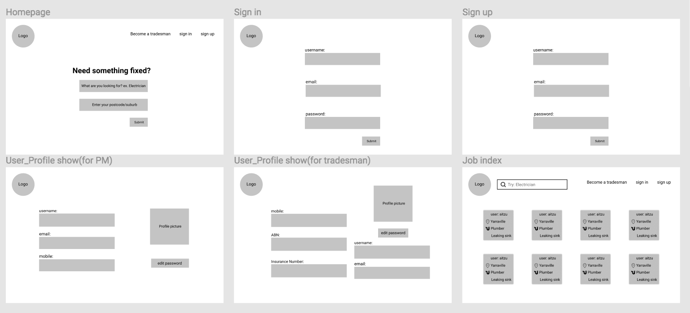

### Mobile wireframe
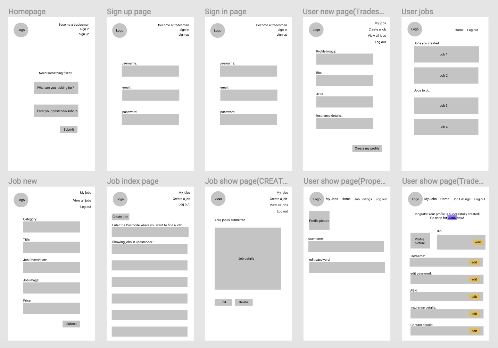

## Database Entity Relationship Diagrams
# Details of planning process including,
## Project plan & timeline
| Day       | Tasks          | 
| :-------------: |:-------------:| 
| Day 1      | Create rails project, push and deploy early. Create ERD and go through user stories. List jobs that need to be done for the project.  | 
| Day 2     | Complete diagram for user journey. Get the ERD approved and generate the models in the project. Scaffold jobs and generate user using devise.    |
| Day 3 | Implament pundit. Generate user profile. Complete associations. Implament Google geolocation. create actions for generating user profile when a user is registered, for accepting jobs, for completing jobs.     |
| Day 4 | Implament stripe. Add ability to edit user details through the user_profile. Create search function for the jobs index page.      |
| Day 5 | Implament mailer, configure the route paths for links on the nav bar for cases when user is not signed in and when they are.     |
| Day 6 | Implament drag and drop feature for inserting images on the job new page. Website design through Figma.      |
| Day 7 | Polish text on the site, CSS.      |
| Day 8 | Finish CSS.     |
| Day 9 | Testing. Complete ReadMe. Power Point presentation.     |
| Day 10 | Submit assignment.      |

###Group communication

###Our Trello
https://trello.com/b/AQ31YGK7/rails-project

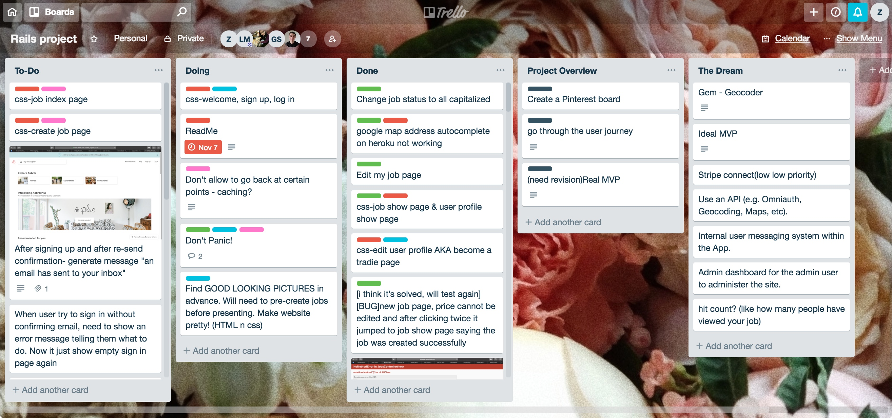

# Important Lessons We Learnt & Future Builds

# Questions

1. What is the need (i.e. challenge) that you will be addressing in your project?

The real estate industry is one of the largest industry in Australia. In saying that, we would like to assist property managers to find tradespeople when all their regular tradespeople are too busy or unable to attend as soon as required. 

We are also creating a platform for tradespeople who are able to go to to earn some extra money if they happen to have the time.

2. Identify the problem you’re trying to solve by building this particular marketplace App? Why is it a problem that needs solving?

The problems we are trying to solve is where property managers often find it difficult to get a tradesperson to perform a task due to reasons such as little pay,short time, limited reach of tradespeople and their unavailability, especially during peak season. 

By solving this, there is more efficiency and less time chasing up leads as the application will cut off time being used to find a tradesperson. 

3. Describe the project you will be conducting and how your App will address the needs.

Along with it being a platform to connect maintenance which needs fixing and tradespeople with spare time. We will also be providing a place to compile maintenance jobs in an easy to manage and user friendly way. 

We all know a property manager who struggles with ensuring maintenance is done, this is largely due to the systems in place being unfriendly to users and hard to understand with so many steps just to look at current outstanding maintenance.

With our app we will simplify this and generate a page where both property managers and trades people can go to and immediately can identify outstanding jobs, jobs to be paid, etc.

Ideally property managers will even encourage their regular tradespeople to accept jobs through our app.

4. Describe the network infrastructure the App may be based on.

We are using the Heroku platform for our app as it allows us to host it while having us continuously develop our app. PostgreSQL is offered through Heroku as an add-on and provides security for us.

5. Identify and describe the software to be used in your App.

    - HTML is used in conjunction with embedded ruby in the view of the application.
    - SCSS is used in the styling of the application, it aids in user friendliness and visual appeal.
    - Ruby is used in the controllers of the application 
    - Ruby on Rails is the framework used for the basis of the app.
    - Java Script - some JavaScript was used to configure some of the gems used.

6. Identify the database to be used in your App and provide a justification for your choice.

After reviewing our database options which included sqlite and postgresql we settled on the latter for the following reasons.

- PostgreSQL is open-source and free

- PostgreSQL has a strong community, which means finding solutions and information for it is easy.

- PostgreSQL has a strong third-party extensions/tools for design and management purposes.

SQLite's disadvantage to this is that we could not be able to tinker the design and add for better performance in our app. The library is very simple and it isn't made for complex databases as opposed to PostgreSQL.

1. Identify and describe the production database setup (i.e. postgres instance).

    Here I would talk about the specifics of postgres, how it connects to your models, how it sits in overall MVC

    In our schema database we have eight tables. 
    A User_profile table that stores the user's "name", "contact", "business_name" etc. 

    We have a table called "job_categories" where it has categories of each trade you can select from.  A  "job_statuses" table where the user can see whether the job is open or closed.

2. Describe the architecture of your App.

We started by scaffolding Jobs, this generated the models views and controllers. This was necessary as we will require a page to display all the jobs(index) a jobs show page for each individual job, new page to create a job and edit page as well.

We generated users through devise and restricted access to new job page, create, edit and destroy. This is so we can associate the user with a particular job.

We also created a seperate user_profile model, view and controller. We created a method which generates a new empty user_profile each time a user registers. They then have the ability to edit and view the profile. We created a custom action in this controller for my jobs page where all jobs associated with the user is displayed.

The welcome page for our app is managed by the pages_controller and is set to the root path.

For our errors we genrated an errors controller which manages two views including 404 error and 500 errors. 

The charges controller was generated to handle the logic for the stripe gem.

A job mailer and view was also created to handle the emails sent out at different stages of the job status.

Our models are:
-   address.rb
-   application_record.rb
-   job_category.rb
-   job_status.rb
-   job.rb
-   user_job.rb
-   user_profile.rb
-   user.rb

Our views are:
-   devise
    We used devise for the purpose of registration of our users

-   job mailer
    We used this for notifying our users if a job has been taken through email, for payment reminders and payment recieved notifications.

-   jobs
    We used the jobs view to display the forms where the property manager user has to create the job.

-   errors
    This was used to display errors if the user landed on a broken link.(404)

-   pages
-   shared
    The navbar.html.erb displays the navbar on every page.

-   user_profiles
    This displayed user information such as the user's profile picture, bio, state, city etc.

Our controllers are:
-   users
-   helpers
-   application
-   charges
-   errors
-   user_profiles

9. Explain the different high-level components (abstractions) in your App.

    We started by scaffolding Jobs, this generated the models views and controllers. This was necessary as we will require a page to display all the jobs(index) a jobs show page for each individual job, new page to create a job and edit page as well.

    We generated users through devise and restricted access to new job page, create, edit and destroy. This is so we can associate the user with a particular job.
    We also created a seperate user_profile model, view and controller. We created a method which generates a new empty user_profile each time a user registers. They then have the ability to edit and view the profile. 
    
    We created a custom action in this controller for my jobs page where all jobs associated with the user is displayed.

    The welcome page for our app is managed by the pages_controller and is set to the root path.

    For our errors we genrated an errors controller which manages two views including 404 error and 500 errors.

10.  Detail any third party services that your App will use.
    
    - Heroku is used to deploy the website
    - AWS - s3 storage service for storing images uploaded
    - Google geo location API used for auto complete when entering the address field
    - Active storage - image handling
    - pundit - gem is used for authentication, preventing certain users to access certain pages
    - devise - gem is used for the generation of the user model along with the handling us user registration and sign ins.
    - mailer -gem is used to send emails through the app.
    - stripe -gem is used for payment handling and processing
    - http://avatars.adorable.io/ - used to generate unique profile pictures based on usernames, if a user has not uploaded their picture. 

11.  Describe (in general terms) the data structure of marketplace apps that are similar to your own (e.g. eBay, Airbnb).

    A similar market place app would be hipages. 

    We can see that they also have user acounts along with some sort of user profile. We are unsure if this is seperated from the user like our application.

    They have jobs pages including create edit, index etc.

    Quoting system is present which ideally we would like to have in future development. 

    They have some sort of rating system for their trades people. For better user experience and trust this would ideally be added to our application in future development.

12.   Discuss the database relations to be implemented.

    The Jobs table is associated with the user through a join table. A job in this case has 2 users the property manager who is the creator; the first user associated with the job and the trades person who is the acceptor; the second person associated with the job.

    This association may not be necessary at this stage, however we initially intended to have the tenant involved in the process in that case this association may be more useful.

    Te jobs table also holds foreign keys for category and job status. Each job os one of each. the category is set when the job is created and the status is updated after each action.

    The user has one user profile. This is generated after user registration is complete.

13.   Describe your project’s models in terms of the relationships (active record associations) they have with each other.

    - job has_many_attached images
    - job has_many user_jobs 
    - job has_many users, through: user_jobs
    - job belongs_to job_category
    - job belongs_to job_status
    - user has_one user_profile
    - user has_many user_jobs
    - user has_many jobs, through user_jobs
    - job_category has_many jobs
    - job_category has_many job_categories
    - job_status has_many jobs
    - user_profile belongs_to user
    - user_profile has_one_attached image  

14.   Provide your database schema design.

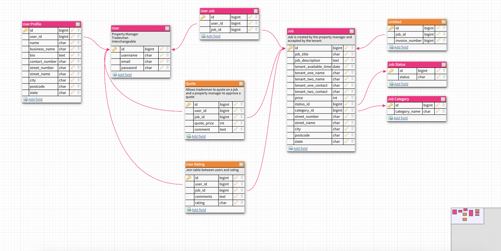

    We seperated our ERD with two colours the pink is to be our MVP what we would aim to complete by the due date. The orange represents additional features we might add on should we have the time.

15.   Provide User stories for your App.

##### Property manager
    1.  In order to get a job done as quickly as possible, I want to be able to find            a tradesperson
    2.  In order to view fix the tenants maintenance issue, as a property manager(buyer), I want to be able to find a tradesperson as quickly as possible.
    3.  As a property manager, I want to be able to have more reach, so that I can find someone to accept the job sooner.
    4.  As a property manager, I want to find someone to do the job during peak periods, so that my tenants don't wait long for repairs.

##### Tradesperson
    1.  As a tradesperson, I want to do find some work to do, so that I can make some money.
    2.  As a tradesperson, I want to do find some work to do, so that I can make some money     while I'm out of a job.
    3.  As a tradesperson, I want to do find some work to do, so that I can make some money     to pay the bills.
    4.  As a tradesperson, I want to do find work at the touch of a few buttons, so that I      can spend as little effort looking elsewhere.
    5.  In order to work as close as home, I want to be able to find the closest job, so        that I don't have to travel too far.

1.    Describe the way tasks are allocated and tracked in your project.
    
We wrote down all the tasks on Trello and tracked them using label tags, users and calendar functions inside Trello. 

In terms of how we allocated the tasks, we decided it’s equally important to make sure everyone learns something from this project and to make sure the MVP is done by due date. 

We identified everyone’s strengths and weaknesses and assigned roles based on them. At the same time everyone had the chance to take a couple of more challenging tasks.

   
1.    Discuss how Agile methodology is being implemented in your project.
     
We have implemented Agile methodology called Scrum. We have done                   this by using Trello board as a tool to assist us in tracking and performing tasks that are broken down into small parts.
     
We used slack to communicate with eachother about our project when we were not together and to show and send links.

Our group agreed on having Lili as a our scrum master. Every morning and before finishing the day, we would go plan, work and reflect on what we were going to do and what we have done.

We would ask questions like, "Does this feature help develop what the client wants", "Is our design meaningful to the client?" etc.

1.    Provide an overview and description of your Source control process.
    
We used Git, the source control program developed for the Linux open source project,and Github to control the source. 
     
Lili, the scrum master of this project, is responsible for maintaining the upstream version on Github while Zainab and Aitzu work on their local branches and create pull requests to Lili.

First Lili created a repository on Github. We cloned the repository and all work on the copies locally on the right branches. After the tasks are done,  we would commit the changes and pushed to origin(Github) where we then created pull requests to the scrum master. 

After Lili received the pull requests she would check the changes, resolved conflicts if any and then merge to the upstream master. 
    
    The upstream repository remained untouched unless Lili consented to merge. We all then would pulled the latest version from upstream to our computers and continued working on the copies locally.  

1.    Provide an overview and description of your Testing process.

 As the number of possible tests for even an simple app like ours is practically infinite, we applied some strategy to select tests that are feasible for the available time and resources. 

We aimed for the app to meet the requirements that guides our MVP design and development, bug-free, respond correctly to all kinds of inputs and restricted the intended environments to only the classroom and our own houses. 
	
We all then run several testings under all intended environments with as many scenarios we can think of as possible and reported the bugs on Trello. 

1.     Discuss and analyse requirements related to information system security.

From our perspective, we believe that any user data handling should relate to the following basic principles:

    1. Ensuring privacy of data is a matter of defining and enforcing information rules – not just rules about data collection, but about data use and retention. People should have the ability to manage the flow of their private information across massive, third-party analytical systems.

    2. Shared private information can still remain confidential. It’s not realistic to think of information as either secret or shared, completely public or completely private. But just because we share and generate information, it doesn’t follow that anything goes, whether we’re talking medical data, financial data, address book data, location data, reading data, or anything else.

    3. Big data requires transparency. Big data is powerful when secondary uses of data sets produce new predictions and inferences. For big data to work in ethical terms, the data owners (the people whose data we are handling) need to have a transparent view of how our data is being used – or sold.

    4. Big Data can compromise identity. Privacy protections aren’t enough any more. Big data analytics can compromise identity by allowing institutional surveillance to moderate and even determine who we are before we make up our own minds. We need to begin to think about the kind of big data predictions and inferences that we will allow, and the ones that we should not.

Authentication is one of the ways in which we have implemented into our project as an information system security. A user can access their own account without having someone else being able to access it too. We have used confirmation emails to authenticate a user as well with Devise.

Our group has also discussed security and safety issues when validating a tradesperson's licence. It's not wise to have tradespeople with no real qualifications and licence to do the job if it means putting others at risk. A form could be developed in the future where their credentials would be checked.

21.     Discuss methods you will use to protect information and data.

Our app collects the user’s name, email, password, physical address and phone number. The methods we have implemented for information security purposes include: user authentication, functional level access control and password encryption using devise and pundit. Users can make payment on our app but it’s handled by Stripe so we are not storing any sensitive data relating to the payment.

We also don't collect data to release to third-parties and through Heroku, we are provided SSL where our user's data is being protected from the server to their computer.

22.    Research what your legal obligations are in relation to handling user data.

Legal obligations for handling user data differ from the laws of each country and depending on where your user(s) are from. In Australia, users are protected by the Privacy Act 1988(Privacy Act), which outlines how an organisation or business must do to handle, use and manage user data.

Australian Privacy Principles(APPs) is found under the Privacy Act: "...
    -   the open and transparent management of personal information including having a privacy policy
    -   an individual having the option of transacting anonymously or using a pseudonym where practicable
    -   the collection of solicited personal information and receipt of unsolicited personal information including giving notice about collection
    -   how personal information can be used and disclosed (including overseas)
    maintaining the quality of personal information
    -   keeping personal information secure
    -   right for individuals to access and correct their personal information ...”
[I'm an inline-style link](https://www.oaic.gov.au/privacy-law/privacy-act/australian-privacy-principles)
